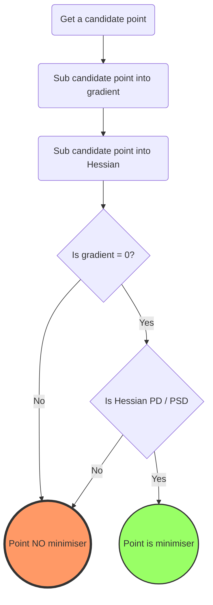
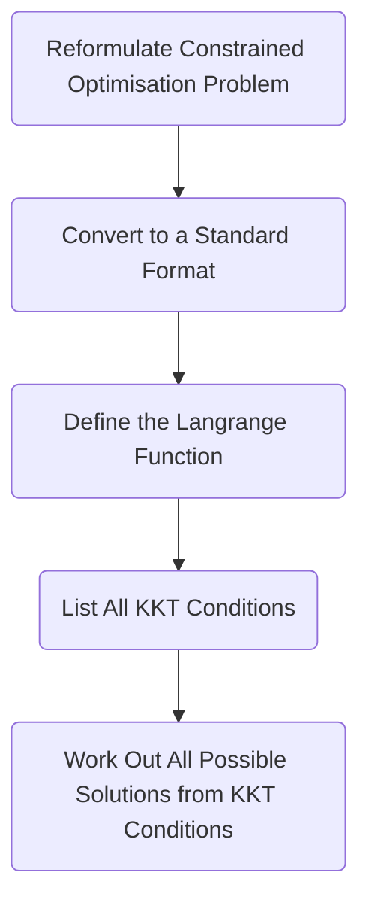
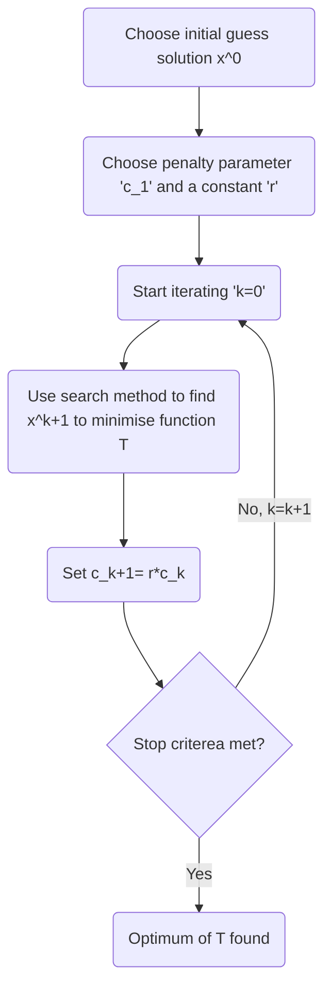

---
aliases:
  - optimal
  - optimisation
  - Optimization
  - optimization
tags:
  - maths
  - engineering
---
# What is Optimisation
Optimisation looks at minimising defined objective function, which may be constrained or unconstrained. It is a word often thrown around loosely, with many people trying to optimise things in their lives. 

# Why do we need Optimisation?


---
# Objective Functions

^a835ed

---
# 1. Formulating Optimisation Problems

There are 4 steps involved in the formulation of any optimisation problem. Broadly, these steps involve finding what variables influence the outcome, how those variables function by themselves and all together, defining constraints associated with the problem, and finally solving the problem itself.

## 1. Defining Decision Variables

Decision variables are variables that represent choices or decisions that have to be made to achieve the objective of the problem. Examples of decision variables include quantities of manufacturing outputs (Items $A, B, C$), and sizes of shapes (length $x, y, z$). These decision variables are then placed into other variables, normally represented as $x_1, x_2, x_3$.

## 2. Objective Functions

The objective function is usually the part of the question that asks you to optimise (ie maximise or minimise). It is focussed on the output, given the decision variables, and can be thought of as a measure of performance. Some examples include maximise profit or minimise surface area. This is the overall goal of the optimisation.

Objective functions are not always obvious or clear for all optimisation problems. It is possible that you’ll end up in a position where you have to define the objective function in terms of the constraints of the problem.

Once the objective function is found, the [[#1. Defining Decision Variables|decision variables]] are then adjusted to optimise the objective function.

## 3. Defining Constraints

Constraints are used to limit the optimisation problem to realistic scenarios. This can include physical space limitations, time limitations, resource constraints and the rules of an organisation. The process of defining the constraints has five steps

### I) Identify Constraints

By looking at how the problem is defined, constraints are usually found. Each decision variable should have a form of constraint. Look out for limitations in time, land or people.

### II) Express as Equations

Now that the constraints have been identified, it is time to translate them to maths. For a question with three decision variables, and a constraint of 620, the constraint equation is presented as follows:

$$ 5x_1 + 6x_2 + 6x_3 \le 620 $$

### III) Using the Correct Inequality

Constraints are often presented as inequalities. Using the correct one, and ensuring the inequality symbol is pointing in the correct way is critical. Here are some standard rules for inequalities:

1. if the resource is limited, use the $\le$ symbol.
2. if the resource is infinite, use the $\ge$ symbol.

### IV) Non-negativity Constraint

Each decision variable needs to be greater than zero. Ensure that the inequalities match this.

### V) Check for Consistency

It is important to check that constraints are consistent and do not contradict one another. Hence, constraints should not be mutually exclusive nor contradictory.

## Finalising and Solving the Model

By this point you’ve formulated your optimisation problem and it is ready to be solved. Depending on the complexity of the problem presented, manual methods or computer-based methods may be more appropriate.

### An Example Program

```octave
% Define the decision variables
x = height(3);

% Define the objective function
f = [-52; -56; -48];

% Define the constraints
A = [5 6 6; 4 4 3; 4 4 2];
b = [620; 410; 380];

% Set the lower bound for the decision variables
lb = [0; 0; 0];

% Solve the linear programming problem
[x,fval] = linprog(f,A,b,[],[],lb);

% Print the results
fprintf('Number of Model A desks produced: %d\\n', x(1));
fprintf('Number of Model B desks produced: %d\\n', x(2));
fprintf('Number of Model C desks produced: %d\\n', x(3));
fprintf('Maximum Profit: £%d\\n', -fval);
```


---
# Unconstrained Optimisation

Unconstrained optimisation is the process of finding the maximum or minimum of a given function without any restriction on the value of the variables. This is different from constrained optimisation, which involves finding the maximum or minimum of a function while satisfying a set of constraints, such as the value of the variables must be greater than a certain number. Unconstrained optimisation is used to find the best solution when the constraints are not known.

# Conditions for Optimality

## First Order Condition

The first order condition essentially states that an optimum point will have a gradient of zero. Formally, we state

$$ \exists \ x^* \iff \nabla f(x^*)=0 $$

In essence, an optimum point $x^*$ exists if and only if the gradient of the function at that point is zero.

## Second Order Conditions

### Condition 1

If the optimum point $x^*$ is a local minimum of a function $f(x)$ then the Hessian $\nabla^2f(x)$ at the optimum point $x^*$ must be [[Matrix Characteristics|positive semi-definite]].

Formally, we state

$$ x^* \text{is minimum} \iff \nabla^2f(x^*) \text{ is PSD} $$

### Condition 2

For a function $f(\vec x)$ for $\vec x=(x_1,x_2,\dots,x_n)^T$, if at a point $x^*$ we have

1. $\nabla f(x^*)=0$ ($x$ is a stationary point)
2. $\nabla^2 f(x^*)$ is [[Matrix Characteristics|positive definite]] (ie $\nabla^2f(x^*)$ is PD)

Then we can say $x^*$ is a local minimum of the function $f(x)$

# Checking if a Point is a Minimum

Both first and second order conditions *have to be met* in order for a point to be a minimum.



# Methods for Optimising Unconstrained Problems

## Standard Procedure

## Least Squares

The method of least squares is a common method used in a variety of fields to find optimum points given some matrices. $\Phi$ and our optimisers $\hat \beta$.

$$ \Phi^T\Phi \hat\beta=\Phi^TY \therefore \hat \beta =(\Phi^T\Phi)^{-1}(\Phi^TY) $$

### Key Points

- The [[Matrices#^8a05b2|pseudoinverse]] that occurs, as a result of $\Phi \not \in \mathbb R^{n\times n}$ ie _not_ being square.
- $\exists \hat \beta \iff (\Phi^T\Phi)$ is _positive_ _definite_ and _invertible_.
- for $(\Phi^T\Phi)$ to be positive definite, input must be _persistently exciting_.

---

# Constrained Optimisation
# Lagrange Multipliers

Lagrange multipliers are an important tool for engineering system optimisation. They are an essential part of the calculus of variations, which is used to solve problems when optimising engineering systems. It is a method of finding a maximum or minimum of a function subject to constraints. Lagrange multipliers make it possible to solve optimisation problems in which one or more of the constraints are nonlinear. They provide a powerful tool for obtaining the optimal solution to a wide variety of engineering optimisation problems.

# Lagrange Method

## Definition

We formally define the Lagrangian function as follows:

$$ \mathcal L(x,\lambda)=f(x)+\lambda_1g_1(x)+\dots+\lambda_ng_n \ where \ \lambda>0 \forall \lambda $$

Where $n$ is the number of inequality constraints given in the formulated optimisation problem.

## Further Explanation

The Lagrange method put simply is to evaluate all the _critical points_ in $f$ given the restrictions posed by $g$. To do this, we solve:

$$ \nabla f=\lambda \nabla g $$

A good explanation is given on [math.stackexchange](https://math.stackexchange.com/questions/1290487/why-do-lagrange-multipliers-work/1290499#1290499). We summarise this explanation here:

We use $\nabla f$ to indicate where to go, and we use $\nabla g$ as an indicator of where not to go, as directions on $\nabla g$ diverge from the surface of $\nabla f$. When both $\nabla f$ and $\nabla g$ point in the same direction, we can’t improve the value of the objective function $f(x)$ nor can we exercise any other possible movements due to the constraints in $\nabla g$ hence we find the optimal points.

## Example

# Karush-Khun-Tucker Conditions

The Karush-Khun-Tucker (KKT) conditions are needed and enough for a solution to exist for a nonlinear optimisation problem with limits. These KKT conditions have been used a lot in optimisation and are often labeled as the "optimality conditions". The KKT conditions give a necessary and sufficient condition for a solution to be optimal. Plus, they give a way to check if a solution is optimal.

## First Order KKT Conditions

For a given Lagrange function $\mathcal L (\vec x, \vec \lambda) = f(\vec x)+ \lambda_1g_1(x)+\dots+ \lambda_ng_n(x)$

1. All Lagrange multipliers must be non-negative:
    1. $\lambda_n \ge 0 \forall \lambda$
2. The gradient of the Lagrange function must be zero:
    1. $$
\nabla_x \mathcal{L} = 0 \;\implies\;
{\partial \color{green}{f} \over \partial x_i}
+ \lambda_1 {\partial \color{blue}{g_1} \over \partial x_i}
+ \lambda_2 {\partial \color{blue}{g_2} \over \partial x_i}
+ \dots
+ \lambda_n {\partial \color{blue}{g_n} \over \partial x_i}
= 0
$$

1. Active/inactive determinants:
    1. $\lambda_jg_j(x_1, \dots ,x_n)=0 \ \ for \ \ j=1,\dots, q$
        1. $\lambda_j\gt0$ if constraint is active
        2. $\lambda_j=0$ otherwise
2. Inequality constraints:
    1. $g_j(x_1,\dots, x_n)\le0$

---

# Lagrange Method for Inequality Constrained Optimisation Procedure



---

# Penalty Methods

Penalty & reward functions are opposites of one another. Whereas reward functions encourage good behaviour, penalty functions penalise bad behaviour.

In the context of optimisation, penalty methods are used in constrained optimisation. They reframe the constrained problem into a series of unconstrained problems which converge to a solution.

Putting this in a real world context, imagine the following:

Suppose there is a toll road that monitors when you enter and exit. The toll road also monitors your speed throughout. You are able to drive at any speed you want. Any speed below 100km/h is free, and you don’t pay a toll. Any speed above 100km/h, you are charged £1000 for every km/h above 100km/h.

This is the the same idea as with penalty methods. Adjusting the fine or ‘penalty’ you’re able to influence the behaviour of the drivers on the road.

# Restructuring the Problem

When an optimisation problem is presented and you intend to use a penalty method, the problem needs to be restructured. Let’s look at an example:

Say we want to minimise a function $f(\vec x) = {100\over x}$ given the constraint $x\le5$.

We start by converting the constraint: $x\le 5 \therefore x-5\le0$

Hence, we have the problem as follows:

$$ \min(f(\vec x))=\min {100\over x} \\ s.t. \ x-5\le0 $$

Because we _minimise_ the function, we want to _increase_ penalty each time the constraint is violated. As such, we end up with a maximisation problem within the minimisation problem. If the optimisation problem is a maximisation problem, then we minimise the constraint within the maximisation problem.

Hence, we form the penalty function for this problem as follows:

$$ P(x)=\begin{cases} 0 & x-5\le0\\ max & x-5\gt0 \end{cases}

$$

Which then becomes

$$ P(x)=\max(0, x-5) $$

The function $P(x)$ returns the maximum of two values, either $0$ or the value of $x-5$.

It is possible to make penalty functions more or less severe and often depends on the context of the optimisation problem. One way we could make $P(x)$ more severe is as follows:

$$ P(x)=\max(0,x-5)^2 $$

This example is known as the _quadratic loss function_.

The next step in the process of minimising the objective function $f(x)$ is to combine it with all the penalty functions $P(x)$ and put these into a new function $T(x)$, as follows:

$$ T(x)=f(x)+P(x)={100\over x}+\max(0,x-5)^2 $$

The addition of the penalty function $P(x)$ can create large slope changes in the graph at the boundary, in our example $x-5\le 0$. This can interfere with the minimisation procedure. There are two solutions used to address this issue. Either we can be specific about our chosen minimisation method, or we can multiply our penalty function $P(x)$ by a constant $\sigma$.

### Constant

We start by setting $\sigma=10$, a relatively mild penalty. This penalty won’t form a sharp point in the graph, but similarly won’t be severe enough penalty to minimise the function properly.

We then set $\sigma =100$, forming a sharper graph and more accurate solution. Each iteration we increase $\sigma$, until the solution converges.

### Method

The second solution is to be thoughtful with how we minimise. These include interval methods. The program started with an interval and narrowed it in from the endpoints.

With a severe nonlinearity, interval methods have a tendency to skip right over the minimum.

Interval methods are not ideal for penalty functions; better to use methods that take small steps from the starting point, like those used in 1- or 2-variable minimisation. Run the program multiple times from various starting points to avoid local extremes.

## Final Step

Now that we’ve outlined the two different solutions, we choose the constant as this is more easily implementable in code. d

$$ \min T(x)={100\over x}+\sigma\max(0,x-5)^2 $$

The initial point $x$ must be chosen to be _outside the boundary condition._

### Optimisation Iteration

$T(x)$ will not optimise at the first point, $x^{(0)}$, so will have to go through a number of iterations as it converges to a solution. For this, a number of ‣ can be used. The iteration approximately follows the following diagram:



### Stop criteria

One example of a stop criterion is $||c_k|| = ||c(x^{(k)})||$ is _sufficiently large._

# The Penalty Function

Penalty functions are relatively hard to define, and are usually unique to each problem. There is no ‘one-size fits all’ approach when designing a penalty function.

