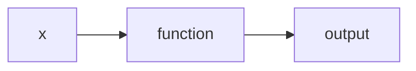

---
aliases:
  - functions
  - function
  - Function
tags:
  - maths
---
# What is a Function?
## Basic Definition
A function is a mathematical operation that describes how a variable is altered, based on the inner workings of the function. Functions themselves can be thought of as processes, and by inputting a value to the process, we get the result of what the process does to the value. 

$$
x\rightarrow \fbox{function()} \rightarrow f(x)
$$
Above, the input $x$ is passed into the function $function()$. The result of inputting $x$ into the function is the output $f(x)$. 
### Visualisation
When visualising the function $f(x) = x$ we see a line. This line tells us that for every time we input 1, we get 1 as an output. As we go along the number line on the horizontal axis, we go along the number line at the same rate on the horizontal axis.

<iframe src="https://www.desmos.com/calculator/j1thkiirwu?embed" width="500" height="250" style="border: 1px solid #ccc" frameborder=0></iframe>

## Intuitions
Functions can take many forms, since there are many real-world processes that are described by functions. It is therefore important to develop an intuition around some of the basic  functions. 
### Linear Functions

#### Simple Addition
Linear functions, such as $f(x) = x + x + x = 3x$ then show that for one input to the function ($f(x)$) we get three times that input, $3x$ as the output. 

<iframe src="https://www.desmos.com/calculator/tvyo4qth6u?embed" width="500" height="500" style="border: 1px solid #ccc" frameborder=0></iframe>

#### Equation of a Line
The equation of any line can be generalised to $f(x) = m \cdot x + c$ . Where for any input $x$ we output $m \cdot x$  and add $c$. 
- $m$ corresponds to the *gradient* of the line.
- $c$ corresponds to the *y intercept* of the line. 

<iframe src="https://www.desmos.com/calculator/mo305n5vx3" width="500" height="500" style="border: 1px solid #ccc" frameborder=0></iframe>

### Non-linear Functions

#### Exponentials
Exponentials describe *how many times a variable is being multiplied by itself*. In other words, how many times are we *feeding back* a variable, for any given input of that variable. 

<iframe src="https://www.desmos.com/calculator/4vzfym1hcx?embed" width="500" height="500" style="border: 1px solid #ccc" frameborder=1000></iframe>

## Formal Definition
A function, formally, maps elements of one [[Sets|set]] to elements of another set. 

# Why do we need Functions?

---
# Functionals

## Basic Definition

# Why do we need Functionals?
