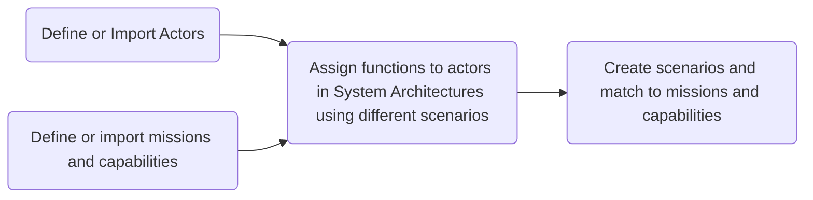

---
aliases:
  - Capella
  - MBSE
---
Here is the [Reference Manual](https://mbse-capella.org/resources/arcadia-reference/html/output/ARCADIA/) for Capella
# What is Capella
Capella is an MBSE tool that assists the user in going through the whole [[Model Based Systems Engineering (MBSE)]] process. The advantage of Capella is that it ensures chains throughout the various scales - from the high level problem to the logic that solves a minute sub-problem. 

# Why Capella?
Capella helps you identify opportunities to innovate. Sustained innovation is the goal, and Capella helps that happen. It does this by employing the ARChitecture Analysis & Design Integrated Approach (ARCADIA) method. ARCADIA helps you understand the problem, and define what parts of the problem you need to address. In helping define the problem, communication of the problem becomes easier to other parts of an organisation, including non experts. 

# Innovation With Capella Course

## Key Features
### Automated Documentation
Including summaries on each object ensures comprehensive documentation, which can be compiled in a consistent way. 

### Plugins
There are many [plugins](https://mbse-capella.org/addons.html) for Capella. 

### Creating Different Diagrams
It is normal to create a variety of diagrams, each outlining a specific function of the system in question. 

## Using [[System Modelling|System Models]]
### Definitions
![[System Modelling#Systems]]
![[System Modelling#Models]]

Online Tutorials:
https://iexcelarc.com/operational-analysis-step-by-step/
https://gettingdesignright.com/GDR-Educate/Capella_Tutorial_v6_0/

### MBSE Relationships

### Extends and Includes

**Extends**:
1. Extends the Functionality of...
	1. Child to Parent
2. Asynchronous
3. Optional / Conditional
4. 
5. 

**Includes**: 
1. Includes the functionality of...
	1. Parent to Child

SITUATION: *if you need to drive to somewhere close*:
you *extend* the functionality to fill up on petrol
you *include* the functionality to put your key in the ignition   

## Operational Analysis
Operational analysis will help you understand the problem you wish to solve by modelling the problem. The boundary for what is included at this phase is not strictly clear, but it is important that it is more general than what is used on the system analysis level. This is because **all elements on a given level need to be realised in a subsequent level**. Operational analysis being the top level implies that all entities, capabilities and activities need to be general enough to be further refined at the next level. It is also important **NOT to mention or architect a solution** for the given problem. 

### Operational Entities (OEBD)
Operational entities provide a high-level representation of the different entities that the system will use in its operation. An entity that cannot be reduced further than a human being is referred to as an 'actor', and an entity that a human being interacts with (eg an organisation or a toy or a computer) is simply an operational entity. 

### Operational Capability (OCB)
An Operational **Capability** blank diagram depicts the *capabilities* the users expect. These are analogous to high-level system requirements. They should be solution agnostic. In this, Capella depicts Actors and Entities through a modelling notation. Capella also depicts Operational Capabilities in a modelling notation. 

### Operational Activity

An Operational **Activity** diagram visually demonstrates how the system will deliver the operational capabilities through Operational Processes. In this context, Capella depicts **Actors** and **Entities** that deliver **Functions**. These functions, when combined, become **Functional Chains** to deliver capabilities. 

A set of operational activities can also be thought of as *Use Cases*. This is also referred to as a Scenario. Every operational capability needs to have a corresponding use case / scenario. Sometimes the operational capability warrants an explanation through multiple use cases/scenarios. 

Activities in the context of ARCADIA warrant the use of multiple diagrams, each representing a different scenario. Because objects are linked within Capella, an overarching diagram is then created, combining all scenarios. In other methodologies these are referred to as 'use cases'. Scenarios *explain* a given capability, and a capability can have multiple scenarios explaining it. When the process is completed, the idea is to have activities, allocated to operational entities or actors, and these activities will have interactions defined between them. We can organise this process as the following:

1. Define the scenario
2. Define all the activities
3. Allocate the activities to actors
4. Define interactions
5. Define the operational processes

### Operational Entity Scenario
This part of the process *links the operational activities with the operational capabilities*. There should be a scenario for each operational activity, to fully realise each operational activity for the system in question. From a Capella perspective, any scenario with no matching operational capability is irrelevant to the project. 

In this phase, transitions between activities are marked by a form of exchange between actors. These exchanges are general, and could include: information transfer, signal that an activity has completed, a physical transformation (something moving/changing), a request for a service etc. 

### Operational Activity Interaction
The purpose of the Operational Activity Interaction diagram is to model and/or display the interactions previously outlined in the Operational Entity Scenario. Again, this can warrant multiple diagrams. 
#### Operational Processes

**Right click a link between activities to define a process.**  

We can define operational processes using the links between the activities in the Activity Interaction diagram. An operational process is a sequence of linked activities where the sequence may have multiple starting points, but **must** have a singular end point, and **cannot** include cycles (where the same activity is visited twice). It is possible to have a sequence that shows up repeatedly in different scenarios. 

### Operational Architecture
The operational architecture diagram is supposed to be a compact description of the operational view. No new objects should be defined at this stage. The goal of the operational architecture diagram is to summarise all the previous processes performed during the operational analysis. 

## System Analysis
In the system analysis phase, requirements are formalised via the following workflow:
1. Identify system boundaries
2. define what the system shall accomplish for users
3. Model functional data-flows and dynamic behaviours

Operational analysis is intentionally solution agnostic. System analysis begins to outline the structure of the solution, by translating operational requirements into system requirements. In the system analysis phase, consider the system, its environment, its boundaries, its interactions with the environment, and what it does. We **do not describe how it does what it does**, as that is for the subsequent phase, the [[#Logical Architecture|logical architecture]] phase. 

### Contextual System Actors
Capella has the capacity to create *system* actors based on the previously made *operational* actors. These can all typically be ported over using the embedded 'contextually create system actors' tool. 

The contextual system actors diagram creates a new system element, and connects all actors to this element. 

It is also worth considering **system boundaries** at this point. If your system is a toy catapult, should you include projectiles as part of the system? There are pros and cons - we could provide styrofoam balls, or we could conclude that a user would find their own projectiles. If it was a design decision to include the styrofoam balls, then it is included within the system, and we don't have to define new actors. If we decide to not include it, it is still an entity that interacts with the system, hence needs to be defined as an actor outside the system (system actor). 

### Missions and Capabilities
Operational capabilities need to be translated into missions and capabilities. They can all be imported from the operational analysis phase via the automated tool. 

Import missions and capabilities. Define clearly few missions, and relate them to **system actors**. In large projects, break down the missions into capabilities. Relate the capabilities to both the mission and actors. Don't forget to make multiple diagrams if needed. 

### Functions & Functional Exchanges

*What is a functional exchange*?
A functional chain describes the usage of a system in a given context. A logical organisation of functions and functional exchanges lead to the fulfillment of a capability.  

https://mbse-capella.org/resources/arcadia-reference/html/output/ARCADIA/69b670d6586c4a63a3e8924930f76dc6.html

https://github.com/eclipse-capella/capella/blob/master/doc/plugins/org.polarsys.capella.ui.doc/html/05.%20Diagram%20Management/5.5.%20Creation%20of%20Functional%20Chains%20and%20Physical%20Paths.mediawiki

The system architecture diagram is useful for defining functions and functional exchanges. This uses the **System Architecture Blank Diagram** as with the [[#Operational Architecture]] phase. **Create swimlanes**, and place the system in the centre, where the **user is on the left**, and any **external entities are on the right**. Import the functions outlined in the previous phase by selecting `allocated functions`. Each diagram represents a scenario, and therefore this process also warrants multiple diagrams. 

This is the phase where **functional requirements** are outlined. Remember that system analysis is not the phase where we define **how the solution works**. As such, do your best to think abstractly and do not be too specific, as to leave design room to truly meet the requirements. 

## Logical Architecture

